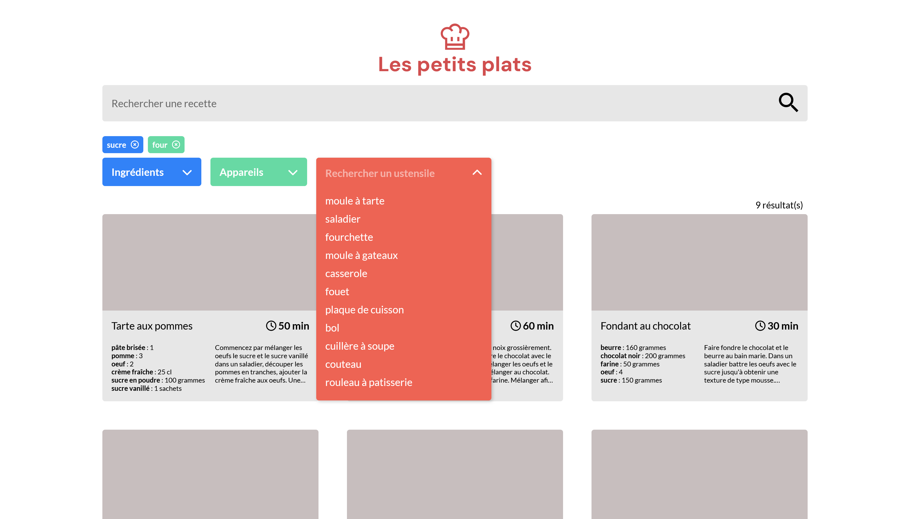

# Les Petits Plats

Les Petits Plats is an application that provides cooking recipes. We had to build the application and pay particular attention to the filtering algorithm. All recipes had to be filterable by ingredients, utensils or kitchen appliances used. A good way to discover sets in JavaScript.

  

  

